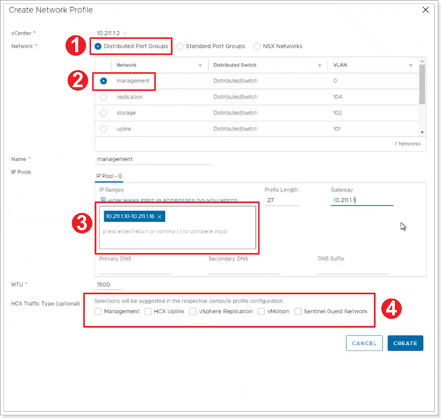


You will perform the instructions below from the On-premises VMware Environment


## **HCX Network Profiles**

A Network Profile is an abstraction of a Distributed Port Group, Standard Port Group, or NSX Logical Switch, and the Layer 3 properties of that network. A Network Profile is a sub-component of a complete Compute Profile.

> Customer’s environments may vary and may not have separate networks.

In this Task you will create a Network Profile for each network intended to be used with HCX services. More information can be found in VMware's Official Documentation, [Creating a Network Profile.](https://docs.vmware.com/en/VMware-HCX/4.3/hcx-user-guide/GUID-184FCA54-D0CB-4931-B0E8-A81CD6120C52.html)

* **Management Network** - The HCX Interconnect Appliance uses this network to communicate with management systems like the HCX Manager, vCenter Server, ESXi Management, NSX Manager, DNS, NTP.
* **vMotion Network** - The HCX Interconnect Appliance uses this network for the traffic exclusive to vMotion protocol operations.
* **vSphere Replication Network** - The HCX Interconnect Appliance uses this network for the traffic exclusive to vSphere Replication.
* **Uplink Network** - The HCX Interconnect appliance uses this network for WAN communications, like TX/RX of transport packets.

> These networks have been defined for you, please see below section.

In a real customer environment, these will have been planned and identified previously, see here for the [planning
phase](https://docs.microsoft.com/en-us/azure/azure-vmware/plan-private-cloud-deployment#define-vmware-hcx-network-segments).

### Step 1: Create 4 Network Profiles

1. Click **Interconnect**.
2. Click **Network Profiles**.
3. Click **CREATE NETWORK PROFILE**.

In this lab, these are in the [Network Profile Information](##network-profile-information) section. 

We will create 4 separate network profiles:
  * [Management](#network-profile-information)
  * [Uplink](#uplink-network-profile)
  * [vMotion](#vmotion-network-profile)
  * [Replication](#replication-network-profile)

### Step 2: Enter information for each Network Profile

1. Select **Distributed Port Groups**.
2. Select **Management Network**.
3. Enter the **Management Network IP** range from the table below. Remeber to replace X with your group number and Y with your participant number. Repeat the same steps for Replication, vMotion and Uplink Network profiles.
4. Ensure the select the appropriate checkboxes depending on type of Network Profile you're creating.

> You should create a total of 4 Network Profiles.

### **Network Profile Information**

#### Management Network Profile

| **Property**               | **Value**                           |
|----------------------------|-------------------------------------|
| Management Network IP      | 10.**X**.**Y**.10-10.**X**.**Y**.16 |
| Prefix Length              | 27                                  |
| Management Network Gateway | 10.**X**.**Y**.1                    |

#### Uplink Network Profile

| **Property**           | **Value**                           |
|------------------------|-------------------------------------|
| Uplink Network IP      | 10.**X**.**Y**.34-10.**X**.**Y**.40 |
| Prefix Length          | 28                                  |
| Uplink Network Gateway | 10.**X**.**Y**.33                   |
| DNS                    | 1.1.1.1                             |

#### vMotion Network Profile

| **Property**            | **Value**                           |
|-------------------------|-------------------------------------|
| vMotion Network IP      | 10.**X**.**Y**.74-10.**X**.**Y**.77 |
| Prefix Length           | 27                                  |
| vMotion Network Gateway | 10.**X**.**Y**.65                   |
| DNS                     | 1.1.1.1                             |

#### Replication Network Profile

| **Property**                | **Value**                             |
|-----------------------------|---------------------------------------|
| Replication IP              | 10.**X**.**Y**.106-10.**X**.**Y**.109 |
| Prefix Length               | 27                                    |
| Replication Network Gateway | 10.**X**.**Y**.97                     |
| DNS                         | 1.1.1.1                               |
